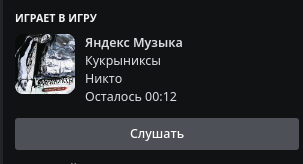

# YandexMusic-Discord-rpc

*Реализация YandexMusic RPC*

Перед запуском RPC убедитесь, что установили все необходимые библиотеки:
`pip install -r req.txt`

Для настройки `app_id` (ID приложения Discord) и ключа API Yandex Music:

Для Windows:
```cmd
setx app_id 123465
setx ym_key AAqQ1234
```

После выполнения этих команд может понадобиться перезагрузка компьютера.

Для Linux:

```sh
export app_id="123123123123"
export ym_key="AQAAAA123123123"
```
В случае с Linux переменные будут действительны только для текущей сессии.

Также можно изменить значения переменных в файле presense.cfg:
```python
app_id = 345345345345 # ID приложения Discord
ym_id = "AQAAAA12312312" # ключ API Yandex Music
```

Пример RPC:



